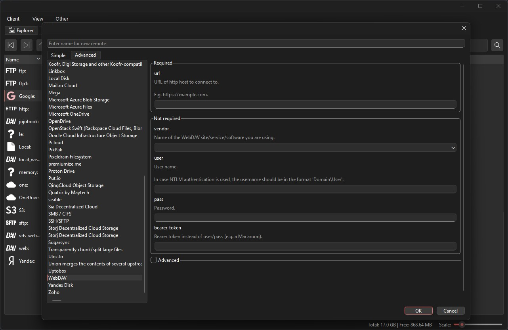

Rclone Navigator
==============
The program for managing files in cloud storage.

Modification for [rclone](https://rclone.org/) command line tool with GUI.

Supports Linux and Windows.

Table of contents
-------------------
* [Features](#features)
* [Sample screenshots](#sample-screenshots)

Features
--------
* Allows to browse and modify any rclone remote, including encrypted ones
* Uses same configuration file as rclone, no extra configuration required
* Lists files hierarchically with file name, size and modify date
* All rclone commands are executed asynchronously, no freezing GUI
* File hierarchy is lazily cached in memory, for faster traversal of folders
* Allows to upload, download, create new folders, rename or delete files and folders
* Allows to calculate size of remote
* Drag & drop support for dragging files from local file explorer for uploading
* Mount and unmount folders on Linux and Windows (for Windows requires [winfsp](http://www.secfs.net/winfsp/))
* Optionally minimizes to tray
* Supports merging remotes into one remote with configuration settings(where files will upload after drag and drop or paste etc)
* Supports creating servers for your remotes, if you don't have one
* Multiple themes for all platforms

Sample screenshots
-------------------
**Explorer**

**Add remote**

**Search**

**Serve**

**Mount**

**Create serve**

